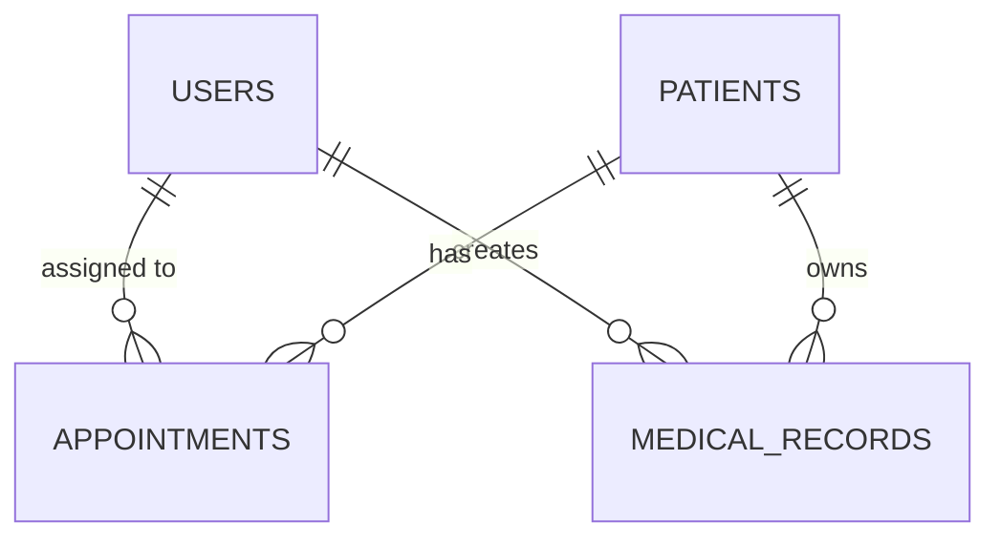

# CLINICOM - Clinic Management System
**Systems Programming with Python Coursework**
**By: [Your Name]**

## 1. Problem Description and Justification
In many developing regions, local clinics and health centers still rely on manual, paper-based systems to record patient details, schedule appointments, and maintain medical histories. This approach often leads to misplaced files, data duplication, slow retrieval times, and inefficiencies in patient care. Furthermore, without proper security and role-based access, sensitive medical data is at risk of unauthorized access.

**Justification**: Developing an automated **Clinic Management System (CLINICOM)** using Python and MySQL solves these issues by providing a centralized, secure, and efficient database for storing patient information, scheduling appointments, and managing medical records. It allows role-based access control, ensuring that receptionists can book appointments while only doctors can view and update sensitive medical diagnoses.

## 2. Objectives of the System
- **Secure Authentication & Authorization**: Implement role-based access control (RBAC) with secure password hashing for Admins, Doctors, and Receptionists.
- **Patient Management**: Allow staff to register new patients and efficiently retrieve existing patient profiles.
- **Appointment Scheduling**: Automate the booking and status tracking (Scheduled, Completed, Cancelled) of patient appointments with specific doctors.
- **Medical Records**: Provide doctors with an interface to securely log patient diagnoses and prescriptions.
- **Professional Menu-Driven Interface**: Utilize modern Python terminal libraries to deliver a clean, user-friendly, and interactive interface suitable for commercial distribution.

## 3. System Design
### Architecture Overview
The system follows a Model-View-Controller (MVC) inspired architecture:
- **Database Layer**: Handled by MySQL server.
- **Data Access Layer (`database.py`)**: A wrapper class managing the connection and executing queries using `mysql-connector-python`.
- **Models (`models.py`)**: Python classes representing real-world entities (Patient, User, Appointment).
- **Controllers (`controllers.py`, `auth.py`)**: Classes that handle business logic, utilizing Object-Oriented inheritance (`BaseManager`).
- **View (`main.py`)**: An interactive command-line interface utilizing the `rich` library.

### Database Schema (ERD Summary)
- `users`: (id, username, password_hash, role)
- `patients`: (patient_id, full_name, dob, gender, contact_info, address)
- `appointments`: (appointment_id, patient_id, doctor_id, date, status, notes)
- `medical_records`: (record_id, patient_id, doctor_id, date, diagnosis, prescription)

## 4. Implementation Details
The project was developed in Python 3, adhering strictly to coursework requirements:
- **Core Functionality & Programming Concepts**: Demonstrates robust use of variables, loops, control structures, and complex data structures (Lists and Dictionaries fetched from the database).
- **File Handling/Database**: Implemented persistent data storage via MySQL instead of flat files for better scalability and commercial viability.
- **Object-Oriented Programming (OOP)**:
  - **Classes & Objects**: Entities like `Patient` and `Appointment` are instantiated as objects.
  - **Inheritance & Encapsulation**: Controllers (`PatientManager`, `AppointmentManager`) inherit from a common `BaseManager` to share the database connection instance, promoting code reuse.
- **Error Handling**: Database operations use `try...except` blocks to catch SQL exceptions and prevent application crashes.
- **Security**: Passwords are mathematically hashed using the `bcrypt` library to ensure data privacy.

## 5. Testing and Evaluation
The system was tested through manual execution and scenario simulation:
1. **Login Test**: Attempted login with correct and incorrect credentials. Successfully verified that invalid attempts are blocked.
2. **Access Control Test**: Logged in as a Receptionist and verified that the "Manage Medical Records" option was correctly hidden, proving RBAC functionality.
3. **Data Persistence Test**: Created a new patient profile, exited the application, and re-launched it. The patient data was successfully retrieved from the MySQL database.
4. **Error Resilience**: Intentionally shut down the MySQL server and attempted to query data. The application gracefully caught the `mysql.connector.Error` and displayed a user-friendly error message rather than crashing.

### Conclusion
CLINICOM successfully demonstrates real-world applicability by solving manual record-keeping inefficiencies while rigorously applying fundamental and advanced Python programming concepts.
